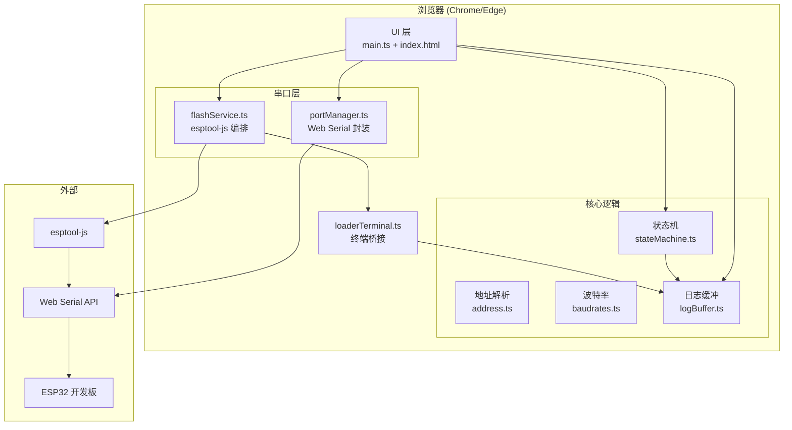
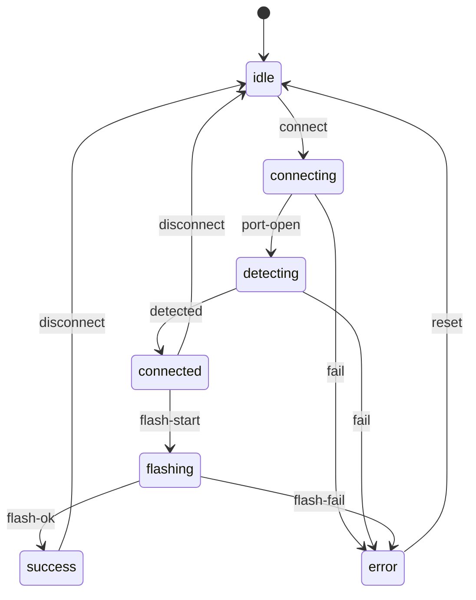
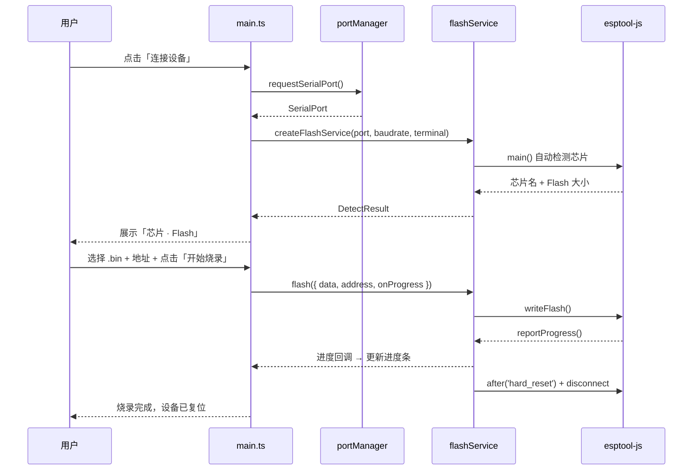

# 架构文档

本文档描述 Flashy（浏览器端 ESP32 固件烧录工具）的架构设计。

## 架构概览



## 目录结构

```
flashy/
├── index.html              # 应用入口页（控件骨架 + 模块加载）
├── vite.config.ts          # Vite 构建配置（base './' 便于子路径部署）
├── src/
│   ├── main.ts             # UI 装配与事件绑定（薄层，被 happy-dom 冒烟测试覆盖）
│   ├── style.css           # 深色控制台风格样式
│   ├── vite-env.d.ts       # vite/client 类型与 __APP_VERSION__ 声明
│   ├── core/               # 纯逻辑模块（零依赖、可直接单测）
│   │   ├── types.ts        # 共享类型定义
│   │   ├── stateMachine.ts # 烧录流程状态机
│   │   ├── address.ts      # Flash 地址解析/校验/格式化
│   │   ├── baudrates.ts    # 波特率预设与校验
│   │   └── logBuffer.ts    # 环形日志缓冲 + 格式化
│   ├── serial/
│   │   ├── portManager.ts  # Web Serial API 封装（能力检测 + 选择设备）
│   │   └── flashService.ts # esptool-js 编排（检测/写入/复位/断开）
│   ├── terminal/
│   │   └── loaderTerminal.ts # IEspLoaderTerminal 桥接到日志缓冲
│   └── __tests__/          # 单元测试 + main.ts 冒烟测试
└── docs/                   # 文档
```

## 关键设计决策

### 为什么用 Web Serial + esptool-js？

- **Web Serial API** 是浏览器原生能力，无需用户安装驱动；本地 `localhost` 或线上 HTTPS 即可使用。
- **esptool-js** 是 Espressif 官方维护的 esptool.py JS 移植，封装了同步协议、波特率切换、Flash 写入与 MD5 校验，避免自行实现底层协议。
- 参考实现为 Espressif 官方的 [esp-launchpad](https://github.com/espressif/esp-launchpad)。

### 为什么不需要手动选择芯片？

`ESPLoader.main()` 在连接时会通过串口自动检测芯片型号（返回如 `ESP32-D0WD-V3`），覆盖 ESP32 / ESP32-C3 / ESP32-S3 / ESP8266 等。因此 UI 无需芯片类型选择，连接后直接展示检测结果。

### 为什么串口由 esptool-js 打开？

`ESPLoader` 构造后调用 `main()`，内部会调用 `Transport.connect(baudrate, serialOptions)` 打开串口（默认 8N1）。因此 `portManager` 只负责**能力检测**与**选择设备**，不重复打开串口。

### 为什么用自研纯状态机？

烧录流程存在明确的阶段（未连接 → 连接中 → 检测芯片 → 已连接 → 烧录中 → 成功/错误），状态迁移有限且非法迁移需要被拦截。自研状态机零依赖、可单测，比引入状态管理库更轻量。

### 为什么 `data` 用 `Uint8Array`？

esptool-js 0.6.1 的 `FlashOptions.fileArray[].data` 类型为 `Uint8Array`，由 `file.arrayBuffer()` 转换得到。

## 状态机迁移表



非法迁移会抛出 `Error`。

## 烧录流程



## 测试策略

| 模块 | 策略 |
|------|------|
| `core/*` | 纯函数直接单测（node 环境） |
| `serial/portManager` | 注入 fake Serial 依赖测试 |
| `serial/flashService` | `vi.mock('esptool-js')` 测试编排逻辑 |
| `terminal/loaderTerminal` | 直接单测 write/writeLine/clean 映射 |
| `main.ts` | happy-dom 冒烟测试（初始化、控件联动） |

覆盖率阈值：行/函数/分支/语句均 ≥ 80%。

## CI/CD

`.github/workflows/ci.yml` 在 push / PR 到 `main` 时执行：类型检查 → 代码检查 → 构建 → 测试 → 覆盖率报告。

`vite build` 产物为纯静态文件，可通过 GitHub Pages 等任意静态托管部署（HTTPS 是 Web Serial 的硬性要求）。
